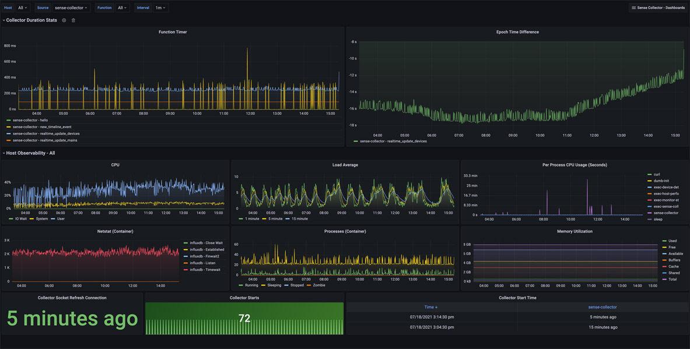
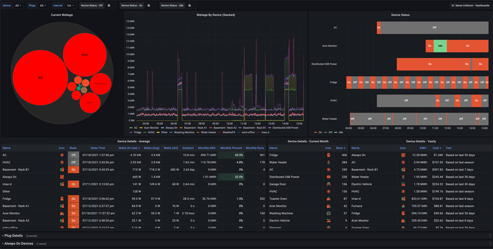
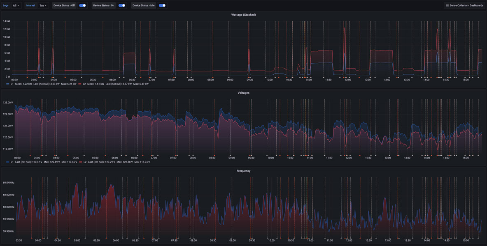
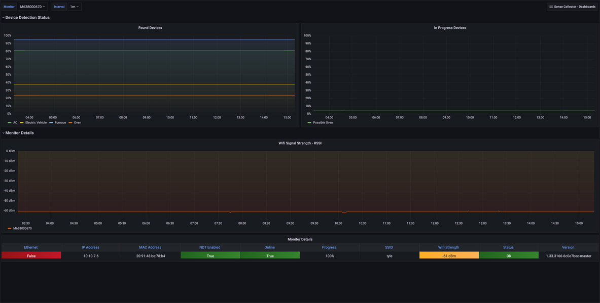

## About The Project

**Sense Collector** is a Python application deployed with Docker designed to efficiently collect data from the [Sense](https://sense.com/) energy monitoring system. Once deployed, Sense Collector provides a comprehensive set of Grafana dashboards, enabling you to visualize and effortlessly analyze your energy usage data in real-time. Whether starting with Grafana, InfluxDB, and Sense or looking to enhance your existing setup, Sense Collector offers an intuitive and powerful solution for monitoring and understanding your energy consumption.

A live set of these dashboards [are available](https://labs.lux4rd0.com/sense-collector/) to view.

## Getting Started

The project is deployed as a Docker container.

## Prerequisites

- [Docker](https://docs.docker.com/install)
- [Docker Compose](https://docs.docker.com/compose/install)
- [InfluxDB 2.x](https://docs.influxdata.com/influxdb/v2/) 
- [Grafana 11.0.0](https://grafana.com/oss/grafana/)

## Deploying the Sense Collector

Use the following [Docker container](https://hub.docker.com/r/lux4rd0/sense-collector):

    lux4rd0/sense-collector:2.0.03
    lux4rd0/sense-collector:latest
    
Correct environmental variables are required for the container to function. 

      SENSE_COLLECTOR_API_PASSWORD
      SENSE_COLLECTOR_API_USERNAME
      SENSE_COLLECTOR_INFLUXDB_BUCKET
      SENSE_COLLECTOR_INFLUXDB_ORG
      SENSE_COLLECTOR_INFLUXDB_TOKEN
      SENSE_COLLECTOR_INFLUXDB_URL

The username and password are the same as those used in the Sense mobile or Sense Web apps.

An example command line would be (be sure to change all of the variables):

To start the docker container, simply update this example compose.yaml file:

    name: sense-collector-53997
    services:
      sense-collector-53997:
        container_name: sense-collector-53997
        environment:
          SENSE_COLLECTOR_API_PASSWORD: CHANGEME
          SENSE_COLLECTOR_API_USERNAME: dave@pulpfree.org
          SENSE_COLLECTOR_HOST_HOSTNAME: sense-collector.lux4rd0.com
          SENSE_COLLECTOR_INFLUXDB_BUCKET: sense
          SENSE_COLLECTOR_INFLUXDB_ORG: Tylephony
          SENSE_COLLECTOR_INFLUXDB_TOKEN: TOKEN
          SENSE_COLLECTOR_INFLUXDB_URL: http://sense-collector.lux4rd0.com:8086
          SENSE_COLLECTOR_LOG_LEVEL_API: CRITICAL
          SENSE_COLLECTOR_LOG_LEVEL_GENERAL: INFO
          SENSE_COLLECTOR_LOG_LEVEL_STORAGE: CRITICAL
          SENSE_COLLECTOR_SENSE_API_RECEIVE_DATA_OUTPUT: "False"
          TZ: America/Chicago
        image: lux4rd0/sense-collector:latest
        restart: always
        volumes:
          - type: bind
            source: /mnt/docker/sense-collector/export
            target: /app/export
            bind:
              create_host_path: true

If you don't want to use docker-compose, an example docker run command will be displayed on the screen.

    docker run --rm \
      --name=sense-collector-53997 \
      -e SENSE_COLLECTOR_API_PASSWORD=CHANGEME \
      -e SENSE_COLLECTOR_API_USERNAME=dave@pulpfree.org \
      -e SENSE_COLLECTOR_HOST_HOSTNAME=sense-collector.lux4rd0.com \
      -e SENSE_COLLECTOR_INFLUXDB_BUCKET=sense \
      -e SENSE_COLLECTOR_INFLUXDB_ORG=Tylephony \
      -e SENSE_COLLECTOR_INFLUXDB_TOKEN=TOKEN \
      -e SENSE_COLLECTOR_INFLUXDB_URL=http://sense-collector.lux4rd0.com:8086 \
      -e SENSE_COLLECTOR_LOG_LEVEL_API=CRITICAL \
      -e SENSE_COLLECTOR_LOG_LEVEL_GENERAL=INFO \
      -e SENSE_COLLECTOR_LOG_LEVEL_STORAGE=CRITICAL \
      -e SENSE_COLLECTOR_SENSE_API_RECEIVE_DATA_OUTPUT="False" \
      -e TZ=America/Chicago \
      -v /mnt/docker/sense-collector/export:/app/export \
      --restart always \
      lux4rd0/sense-collector:latest

Running `docker-compose up -d' or the `docker-run` command will download and start up the sense-collector container. 

## Environmental Flags:

The Docker contain can be configured with additional environment flags to control collector behaviors. They are descript below:

# Sense Collector Environmental Variables

This document provides a detailed explanation of the environmental variables used to configure the Sense Collector Docker container. Each variable is classified as required or optional, along with its default value and possible options.

## Environmental Variables

### SENSE_COLLECTOR_API_PASSWORD
- **Description**: The password for authenticating with the Sense API.
- **Required**: Yes
- **Default**: None
- **Options**: User-provided password

### SENSE_COLLECTOR_API_USERNAME
- **Description**: The username (email address) for authenticating with the Sense API.
- **Required**: Yes
- **Default**: None
- **Options**: User-provided email address

### SENSE_COLLECTOR_HOST_HOSTNAME
- **Description**: The hostname that is running the Docker container. Used in the Collector Info dashboard to know where the Collector is running.
- **Required**: No
- **Default**: None
- **Options**: User-provided hostname

### SENSE_COLLECTOR_INFLUXDB_BUCKET
- **Description**: The bucket name in InfluxDB where data will be stored.
- **Required**: Yes
- **Default**: None
- **Options**: User-provided bucket name

### SENSE_COLLECTOR_INFLUXDB_ORG
- **Description**: The organization name in InfluxDB.
- **Required**: Yes
- **Default**: None
- **Options**: User-provided organization name

### SENSE_COLLECTOR_INFLUXDB_TOKEN
- **Description**: The authentication token for InfluxDB.
- **Required**: Yes
- **Default**: None
- **Options**: User-provided token

### SENSE_COLLECTOR_INFLUXDB_URL
- **Description**: The URL of the InfluxDB instance where data will be written.
- **Required**: Yes
- **Default**: None
- **Options**: User-provided URL

### SENSE_COLLECTOR_LOG_LEVEL_API
- **Description**: Sets the logging level for the API interactions.
- **Required**: No
- **Default**: INFO
- **Options**: DEBUG, INFO, WARNING, ERROR, CRITICAL

### SENSE_COLLECTOR_LOG_LEVEL_GENERAL
- **Description**: Sets the general logging level for the application.
- **Required**: No
- **Default**: INFO
- **Options**: DEBUG, INFO, WARNING, ERROR, CRITICAL

### SENSE_COLLECTOR_LOG_LEVEL_STORAGE
- **Description**: Sets the logging level for storage operations.
- **Required**: No
- **Default**: INFO
- **Options**: DEBUG, INFO, WARNING, ERROR, CRITICAL

### SENSE_COLLECTOR_SENSE_API_RECEIVE_DATA_OUTPUT
- **Description**: Enables or disables the output of received Sense API data to a file.
- **Required**: No
- **Default**: false
- **Options**: true, false

## Collector Details

#### sense-collector

Sense Collector is the primary data collector and is responsible for gathering details on the following:

Voltage, Watts, Hz on the mains, and device-specific wattage details are collected. If you happen to have any [Sense compatible](https://help.sense.com/hc/en-us/articles/360012089393-What-smart-plugs-are-compatible-with-Sense-) smart plugs, their additional metric details of voltage and amps are also collected.

Timeline events for device's change of states (on, off, idle)

#### device-details

Device Details polls the Sense API to gather details on your devices. This includes:

avg_duration, avg_monthly_KWH, avg_monthly_cost, avg_monthly_cost, avg_monthly_pct, avg_monthly_runs, avg_watts, current_ao_wattage, current_month_KWH, current_month_cost, current_month_runs, icon, last_state, last_state_time, name, yearly_KWH, yearly_cost, yearly_text

#### monitor-status

Monitor Status gathers details about the Sense monitor and detection status for both in-progress and found devices. Monitor details include: emac, ethernet, ip_address, mac, ndt_enabled, online, progress, serial, signal, ssid, status, test_result, version, wifi_strength

## Grafana Dashboards

Collecting data is only half the fun. Now it's time to provision some Grafana Dashboards to visualize your essential Sense data. You'll find a [folder of dashboards](https://github.com/lux4rd0/sense-collector/dashboards) with collectors and backends split out. You can also use the links/numbers next to each dashboard title to load the dashboards [directly from Grafana](https://grafana.com/grafana/dashboards?search=sense%20collector).

### In General:

Each dashboard has dropdowns at the top that allow you to filter measurements based on devices and plugs. The dropdowns default to "All," but you can select and save preferences.

**Interval**:  A dropdown that provides different smoothing levels helps manage how the graphs look based on the interval of data collected by the Sense Collector. Think of this as a level of "smoothing" based on your chosen time frame and the quantity of data collected.

**Device Status On/Off/Idle**: These three toggles overlay event annotations in the Wattage By Devices panels and the Wattage, Volts, and Hz panels in the Mains Overview dashboard.

**Sense Collector Dashboard Links**: This dropdown in the top right-hand corner provides easy access to the other dashboards in this collection.

**Time Range**: This defaults to "Today so far" but can be updated to any other Relative or Absolute time range. Change the "Interval" dropdown for longer time ranges to smooth out any of the data.

**Dashboard Refresh**: Each dashboard is set to refresh every sixty seconds, but this can be changed or disabled.

### Collector Info - [14734](https://grafana.com/grafana/dashboards/14734)

**Collector Info**:  This dashboard provides observability into how the Sense Collector functions alongside metrics related to the host's performance. It helps understand the performance of the main collector functions to assist with troubleshooting.

**Epoch Time Difference**: Helps determine if your hosts can keep up with processing messages from the Sense monitor. It provides the difference between the host and epoch times received in the Sense monitor data. Negative numbers mean the Sense monitor is ahead of the hosts. Positive numbers mean the host is behind the Sense monitor. If the drift trends positively, it may also mean there's just time clock drift. Ensure you monitor the NTP time sync on both your host and Sense if there's a large discrepancy.

**CPU, Load Average, Memory Utilization**:  These panels show host-level details and are not specific to the performance of the docker container. Per Process CPU Usage, Netstat, and Processes are particular to the container.

**Collector Starts**: Provide the last time the container and process were started.  Because Sense times out the connection, it is reset every fifteen minutes.

### Device Overview - [14735](https://grafana.com/grafana/dashboards/14735)

**Device Overview** is the main dashboard for Sense Collector. Here, you'll see several sections about the device's overall details.

**Current Wattage**: A Bubble Chart showing current wattage usage by device. Larger circles represent higher wattage consumption.

**Wattage By Device (Stacked)**: Wattage overtime per device. The graph is stacked to represent total household wattage.

**Device Status**: This is a State Timeline representing event data from the Sensor Monitor over time. It currently represents three states: On, Off, and Idle.

**Event Timeline**: This table view shows each device's state change.

**Device Details - Average**: This is a table view of current data representing the current state, state time, watts in use, average, and always on makeup. Average duration, monthly kWh, percent, and the number of runs are also listed. This table defaults to being sorted by "Watts (In Use)."

**Device Details - Current Month**: Shows the number of runs per device since the start of the current month.

**Device Details - Yearly**: This section shows each device's calculated kWh and costs. The text next to each device provides details on how the costs are calculated, such as "Based on the last 30 days," "Based on the last 7 days," or "Based on last season."

**Smart Device Details**: If you have any of the [Sense compatible](https://help.sense.com/hc/en-us/articles/360012089393-What-smart-plugs-are-compatible-with-Sense-) smart plugs, they will be listed here as well. Open up this row to display the voltages and amps measured by each plug. There's another measurement (Who Knows By Plugs), but I don't know what it does yet.

**Always On Devices**: This shows which devices the Sense monitor has detected have an Always On wattage component. This may be different from actual wattage and tends to update less frequently.

> **Notice**: This Grafana dashboard uses the community visualization [Bubble Chart](https://grafana.com/grafana/plugins/digrich-bubblechart-panel/) panel plugin. 

### Mains Overview - [14736](https://grafana.com/grafana/dashboards/14736)

**Mains Overview** provides three panels showing Wattage (Stacked), Voltages, and Frequency. Dropdowns at the top of the dashboard show Leg 1, Leg 2, or both together. Device Status On, Off, and Idle event annotations may be toggled on or off.

### Monitor & Detection - [14737](https://grafana.com/grafana/dashboards/14737)

The **Monitor & Detection** dashboard provides observability of the monitor itself.

**Device Detection Status**:  Represents Device Detection Status for both "Found" and "In Progress" devices.

**Wifi Signal Strength - RSSI**: Represents the Wifi signal strength of your Sense monitor.

**Monitor Details**: This panel shows current information about Online status, General Status, Learning Progress, IP Address, MAC Address, Wi-Fi SSID, Wi-Fi strength, Ethernet, NDT Enabled, and software version. 

## Multiple Devices

The Sense Collector and dashboards currently only support a single Sense instance. If you have more than one Sense device and are interested in having multiple devices supported, please let me know.

### Time Zone Variable

A TZ variable is used when running the Docker container based on the value returned during the initial docker-compose configuration scripts. It's not currently in use in any of the current dashboards.

## Roadmap

See the open issues for a list of proposed features (and known issues).

## Contact

Dave Schmid: [@lux4rd0](https://twitter.com/lux4rd0) - dave@pulpfree.org

Project Link: https://github.com/lux4rd0/sense-collector

## Acknowledgements

- Grafana Labs - [https://grafana.com/](https://grafana.com/)
- Grafana - [https://grafana.com/oss/grafana/](https://grafana.com/oss/grafana/)
- Grafana Dashboard Community - [https://grafana.com/grafana/dashboards/](https://grafana.com/grafana/dashboards/)

